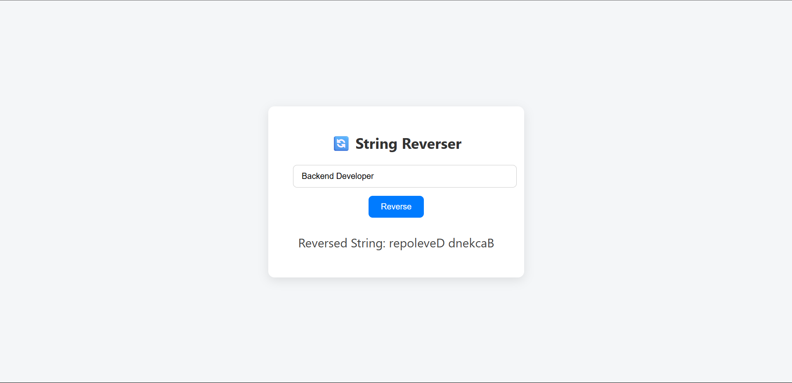

# README - Reverse String Web App

🔄 **Reverse String Web App**

A simple full-stack web application built with **Node.js**, **Express.js**, and **Vanilla JavaScript**, styled using custom **CSS**. The app allows users to input any string and returns the reversed version using a backend API.

---

## 📋 Project Description:

This project was created to demonstrate basic backend logic and full-stack integration. The application accepts user input from the frontend, sends it to a backend API using `POST /reverse`, processes the input by reversing the string, and displays the result back on the frontend.

---

## 🚀 Features:

- API endpoint (`POST /reverse`) to reverse a string  
- Input validation (checks if input is a string)  
- Clean, responsive user interface  
- All files served via Express  
- Minimal dependencies for easy setup  

---

## 📁 Folder Structure:

```
## 📁 Project Structure

reverse-string-app/
│
├── assets/ # UI screenshot or design files
│ └── UI-Screenshot.png
│
├── css/ # Stylesheets
│ └── style.css
│
├── js/ # Client-side JavaScript
│ └── main.js
│
├── node_modules/ # Node.js dependencies (auto-generated)
│
├── .gitignore # Files to be ignored by Git
├── index.html # Main frontend file
├── package.json # Project metadata and dependencies
├── package-lock.json # Auto-generated dependency lock file
├── readme.md # Project documentation
└── server.js # Backend (Express server)
```

---

## 🛠️ Setup Instructions

### ✅ 1. Prerequisites  
Make sure you have Node.js installed:

```bash
node -v  
npm -v
```

---

### ✅ 2. Install Dependencies

```bash
npm install
```

---

### ✅ 3. Run the App

```bash
npm start
```

The server will start on:

```
http://localhost:8000
```

---

## 📬 API Usage

### POST `/reverse`

**Request:**
```json
{
  "input": "hello"
}
```

**Response:**
```json
{
  "reversed": "olleh"
}
```

**Error Response:**
```json
{
  "error": "Input must be a string"
}
```

---

## 🖥️ How It Works

1. User enters a string in the input box.  
2. Clicks the **Reverse** button.  
3. `main.js` sends the input to the backend using `fetch`.  
4. Backend validates and reverses the string.  
5. Reversed string is returned and displayed below the input.

---

## ✅ Notes

- All static files (`index.html`, `main.js`, `style.css`) are served via Express.  
- No external dependencies (like databases) are required.  
- Easily extendable and cleanly organized.  

---

## 👨‍💻 Author

**Muhammad Asim Kundi**  
📧 muhammadasimkundi@gmail.com  
📍 Islamabad, Pakistan  

---

## 📄 License

MIT — free to use, learn from, and improve.

---

## 📸 UI Preview

Below is a screenshot of the actual application UI:


